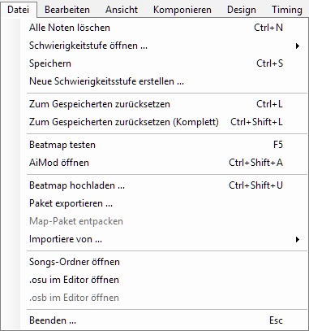
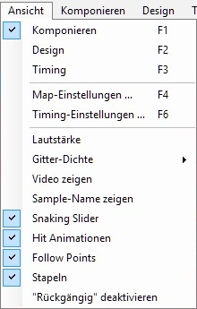
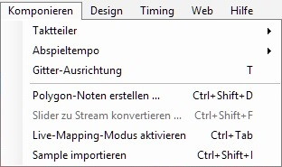
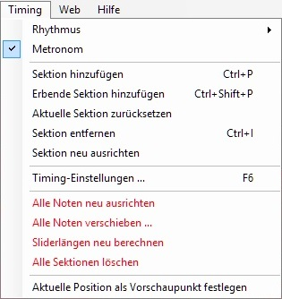

<!-- TODO: This article should use the singular form of "you" (`Du` instead of `Sie`), unless the English version gets rewritten to have no pronouns. Furthermore, there are also some untranslated sentences and grammar mistakes. -->

# Menü

## Datei

**Kommandos.**

### Kommandos

| Name | Beschreibung |
| :-- | :-- |
| Alle Noten löschen (`Strg` + `N`) | Entfernt alle Hit Objekte der Schwierigkeitsstufe. |
| Schwierigkeitsstufe öffnen... | **Zum Editieren:** Schnell zwischen den Schwierigkeitsstufen wechseln. **Zur Referenz:** ist wie Zum Editieren, aber funktioniert derzeitnicht. |
| Speichern (`Strg` + `S`) | Speichert alle Veränderungen (`.osu` und `.osb` Dateien). |
| Neue Schwierigkeitsstufe erstellen... | Erstellt eine neue Schwierigkeitsstufe ohne platzierte Hit Objekte oder eine Kopie des derzeit ausgewählten Schwierigkeitsstufe. |

### Rückkehrfunktion

| Name | Beschreibung |
| :-- | :-- |
| Zum Gespeicherten zurücksetzen (`Strg` + `L`) | Hebt alle Veränderungen auf und kehrt zum zuletzt gespeicherten Zustand zurück. Für kleine Fehler (Hit Objekte) |
| Zum Gespeicherten zurücksetzen (Komplett) (`Strg` + `Shift` + `L`) | Hebt alle Veränderungen auf und kehrt zum zuletzt gespeicherten Zustand zurück. Für komplizierte Fehler (Timing, Storyboard) |

### Kommandos zur Fehlerbehebung

| Name | Beschreibung |
| :-- | :-- |
| Beatmap testen (`F5`) | Test die Beatmap. Current changes will be saved in order to test. |
| AiMod öffnen (`Strg` + `Shift` + `A`) | AiMod öffnen |

### Kommandos für Beatmap Verpackungen

| Name | Beschreibung |
| :-- | :-- |
| Beatmap hochladen ... (`Strg` + `Shift` + `U`) | Ladet die Beatmap hoch. Sie müssen mir Ihrem Account auf der Webseite angemeldet sein, um das Beatmap Forum sehen zu können. |
| Paket exportieren ... | Exportiert die Beatmap als `.osz`. Die Datei wird zum "Exports" Ordner gesendet und der Ordner wird direkt danach geöffnet. |
| Map-Paket entpacken | ? |
| Importieren von ... | **bms/bme:** (nur für osu!mania) Öffnet .bms/.bme Datei, um sie als osu!mania Schwierigkeitsstufe zu importieren. |

### Kommandos für Programmierer

| Name | Beschreibung |
| :-- | :-- |
| Songs-Ordner öffnen | Öffnet den Songs-Ordner, welcher sich im osu!/Songs befindet. |
| `.osu` im Editor öffnen | Öffnet die Schwierigkeitsstufe im Texteditor. |
| `.osb` im Editor öffnen | Öffnet die Storyboarddatei im Texteditor. |

### Emergency Exit command

| Name | Beschreibung |
| :-- | :-- |
| Beenden... (`Esc`) | Beatmap Editor verlassen. Sie werden möglicherweise gefragt, ob Sie speichern wollen. Ignoriert manchmal Veränderungen, die im Design Bereich gemacht wurden. |

## Bearbeiten

Edit commands. Same as default MS shortcuts.

### Kommando für Rückgängig/Wiederherstellen

Diese Kommandos können in den [Einstellungen](/wiki/Client/Options) geaktiviert werden, um ein Crash während dem Bearbeiten von Marathon Maps zu verhindern.

| Name | Beschreibung |
| :-- | :-- |
| Rückängig (`Strg` + `Z`) | Ein Schritt zurück. |
| Wiederherstellen (`Strg` + `Y`) | Ein Schritt nach vorn. |

### Kommandos fürs Bearbeiten (Hit Objekt zuvor markieren)

| Name | Beschreibung |
| :-- | :-- |
| Ausschneiden (`Strg` + `X`) | Entfernt Hit Objekt(e). |
| Kopieren (`Strg` + `C`) | Kopiert Hit Objekt(e). |
| Einfügen (`Strg` + `V`) | Fügt Hit Objekt(e) ein. |
| Löschen (`Entfernen`) | Löscht Hit Objekt(e). |

### Spezielle Kommandos

| Name | Beschreibung |
| :-- | :-- |
| Alles auswählen (`Strg` + `A`) | Markiert alle Hit Objekte. |
| Klonen (`Strg` + `D`) | Kopieren und Einfügen. |

### Kommandos fürs Rotieren

| Name | Beschreibung |
| :-- | :-- |
| Auswahl umkehren (`Strg` + `G`) | **Slider:** Slideranfang und Sliderende vertauschen. **Wähle mehrere Objekte aus:** Der Design der Beatmap wird neu ausgerichtet, quasi andersherum. |
| Horizontal spiegeln (`Strg` + `H`) | Kippt die Hit Objekte(e) von links nach rechts bzw. von rechts nach links (y-Achse ist die Mittelachse). |
| Vertikal spiegeln (`Strg` + `J`) | Kippt die Hit Objekte(e) von unten nach oben bzw. von oben nach unten (x-Achse ist die Mittelachse). |
| 90° im Uhrzeigersinn drehen (`Strg` + `>`) | Hit Objekt(e) um 90° nach rechts drehen. |
| 90° gegen den Uhrzeigersinn drehen (`Strg` + `<`) | Hit Objekt(e) um 90° nach links drehen. |
| Rotieren ... (`Strg` + `Shift` + `R`) | Leg den Rotationswinkel (+/- 180°) für die Hit Objekte fest. Sie können auch die Richtung (im/gegen Uhrzeigersinn) und Position festlegen. |
| Skalieren... (`Strg` + `Shift` + `S`) | Veränder den Abstand für die Hit Objekt um ein Vielfaches (0.500x - 1.200x). Sie können die Position festlegen und ob sich die Objekte nur auf einer oder beiden Achsen verschieben werden sollen. |

### Tasten zum Zurücksetzen

| Name | Beschreibung |
| :-- | :-- |
| Samples des ausgewählten Objekts zurücksetzen | Entfertn den Hitsound vom ausgewählten Hit Objekt. |
| Alle Samples zurücksetzen | Entfernt alle festgelegten Hitsounds von den Hit Objekten. |
| Kombo-Farben zurücksetzen | Setzt alle Kombofarben zurück. |
| Pausen zurücksetzen | Setzt alle Pausen zurück. Funktioniert nicht bei automatisch platzierten Pausen. |

### Kommandos zum Stubsen

| Name | Beschreibung |
| :-- | :-- |
| Stubs zurück (`J`) | Bewegt Hit Objekt(e) um ein Beat zurück im Beat Snap Divisor. |
| Stubs vrfwärts (`K`) | Bewegt Hit Objekt(e) um ein Beat nach vorne im Beat Snap Divisor. |

## Ansicht

### Kommandos für die Tabs

| Name | Beschreibung |
| :-- | :-- |
| Komponieren (`F1`) | Öffnet den Compose Tab. |
| Design (`F2`) | Öffnet den Design Tab. |
| Timing (`F3`) | Öffnet den Timing Tab. |

### Kommandos für Einstellungen

| Name | Beschreibung |
| :-- | :-- |
| Map-Einstellungen ... (`F4`) | Öffnet das Song Setup Fenster. |
| Timing-Einstellungen ... (`F6`) | Öffnet das Timing Setup Fenster. |

### Spezielle Kommandos

| Name | Beschreibung |
| :-- | :-- |
| Lautstärke | Anpassen von 2 Lautstärken (Musik / Sample). |
| Gitter-Dichte | Gittergröße festlegen. 1 (sehr grob)/2/3/4 (sehr fein). |
| Video zeigen | Zeigt das Video an. Normalerweise deaktiviert, da es zu Verwirrungen kommen kann. |
| Sample-Name anzeigen | ? |
| Snaking Slider | Slider von der Startposition aus aufklappen lassen, anstatt sie von Anfang an komplett anzuzeigen. |
| Hit Animationen | Die Animationen passen sich dem vom Gameplay an. |
| Follow Points | Follow Points zwischen den Hit Objekten innerhalb eines Combo anzeigen lassen. |
| Stapeln | ? |
| "Rückgängig" deaktivieren | Beim Editieren von sehr langen Marathon-Editoraps kann das Speichern aller vorgenommenen Änderungen für die Rückgängig-/Wiederholen-Funktion die Perfomance beeinträchtigen. |

## Komponieren

*Hauptseite: [Komposition](/wiki/Client/Beatmap_editor/Compose)*

### Regler

| Name | Beschreibung |
| :-- | :-- |
| Taktteiler | [Beat Snap Divisor](/wiki/Client/Beatmap_editor/Beat_Snap_Divisor) |
| Abspieltempo | Gibt an, wie schnell das Lied abgespielt wird. |
| Gitter-Ausrichtung (`T`) | ? |

### Spezielle Kommandos

| Name | Beschreibung |
| :-- | :-- |
| Polygon-Noten erstellen ... (`Strg` + `Shift` + `D`) | Erstellt einen kreisförmigen Ablauf aus Hit Circles. Sie können den Distance Snap (0.1x - 2.0x) anpassen {Abstand zwischen den Objekten}, Offsetwinkel (0° - 180°) {Rotationswinkel}, Wiederholungen und Puntke (3 - 14/282) {Anzahl an Objekten pro Schleife}. |
| Slider zu Stream konvertieren... | Beat Snap Divisor: Legt den Taktteiler fest. |
| Live-Editorapping-Editorodus aktivieren (`Strg` + `Tab`) | osu!/osu!catch/osu!taiko Maps: Benutzen Sie die osu!taikotasten, um Hit Circles/Früchte/osu!taiko Hit Circles zu platzieren, während Sie das Lied im Editor spielen. Die Objekte werden am Standort des Cursors platziert. osu!mania Maps: Benutzen Sie die osu!maniatasten, um Noten während dem Spielen zu platzieren. Wenn Sie die Taste gedrückt halten, wird kein Slider dadurch erstellt. |
| Sample importieren | [Tastentöne und Sound Sampling.](/wiki/Client/Beatmap_editor/Compose) |

## Design

*Main page: [Design](/wiki/Client/Beatmap_editor/Design)*

| Name | Beschreibung |
| :-- | :-- |
| Alle Objekte verschieben | Bewegen Sie *alle* Objekte um #ms. Ganz nützlich, wenn Sie .mp3 Datei austauschen oder das Offset geändert haben. |

## Timing

*Main page: [Timing](/wiki/Client/Beatmap_editor/Timing)*

### Kommandos fürs Metronom

| Name | Beschreibung |
| :-- | :-- |
| Rhythmus | Walzer (3/4) oder Standard (4/4) Timing. Für exotisches Timing, benutzen Sie das Timing Setup. |
| Metronom | Aktiveren/Deaktivieren Sie die "tic, tic , (tic) , toc" Töne vom Metronom. |

### Kommandos zum Markieren

| Name | Beschreibung |
| :-- | :-- |
| Sektion hinzufügen (`Strg` + `P`) | Erstellt eine neue rote Timing Sektion am derzeitigen Standort. |
| Erbende Sektion hinzufügen (`Strg` + `Shift` + `P`) | Erstellt eine neue grüne Timing Sektion am derzeitigen Standort. |
| Aktuelle Sektion zurücksetzen | ? |
| Sektion entfernen (`Strg` + `I`) | Entfernt die Timing Sektion, in der man gerade befindet. |
| Sektion neu ausrichten | Richtet die Timing Sektion neu aus. |

### Timing Einstellungen

| Name | Beschreibung |
| :-- | :-- |
| Timing Einstellungen... (`F6`) | [Timing Setup.](/wiki/Client/Beatmap_editor/Timing) |

### Spezielle Kommandos

| Name | Beschreibung |
| :-- | :-- |
| Alle Noten neu ausrichten | Richtet alle Hit Objekte zu ihren jeweiligen Sektion um. |
| Alle Noten verschieben ... | Bewege alle Noten um #ms |
| Sliderlängen neu berechnen | Berechnet die Länge der Slider neu (am besten zu benutzen, wenn BPM/ Slidergeschwindigkeit/Slidergeschwindigkeitsmultiplikator geändert wurde). |
| Alle Sektionen löschen | Löscht alle Timing Sektionen. |

### Kommando fürs Vorschau

| Name | Beschreibung |
| :-- | :-- |
| Aktuelle Position als Vorschaupunkt festlegen | Setzt eine gelbe Markierung (das Lied fängt dann im Songauswahl an der Stelle an zu spielen). |

## Web

Öffnet Ihren Browser. Leitet Sie hauptsächlich zum Beatmap-Thread (Sie müssen angemeldet sein).

| Name | Beschreibung |
| :-- | :-- |
| Informationsseite dieser Beatmap | Öffnet die Informationsseite der Beatmap. Der Link ist `https://osu.ppy.sh/beatmaps/###`, ### ist die BeatmapID (findet man in `.osu`). |
| Forenbeitrag dieser Beatmap | Öffnet den Beatmap Thread. |
| Schnellantwort | Erstellen Sie eine Nachricht im Beatmap Thread. |

## Hilfe

| Name | Beschreibung |
| :-- | :-- |
| Ingame-Hilfe anzeigen (`H`) | Öffnet im Editor ein Fenster mit hilfreichen Informationen. |
| FAQ anzeigen | Sie werden nach [FAQ](/wiki/FAQ) geleitet. |
